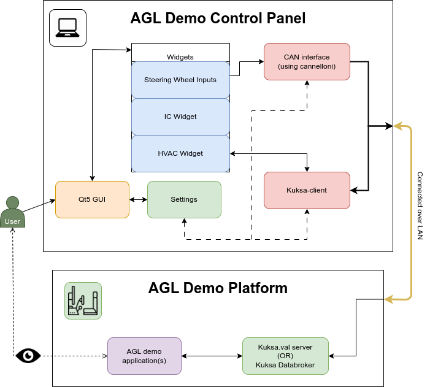

## Introduction

This report is a requirement of the Final evaluation phase of the [Google Summer of Code](https://summerofcode.withgoogle.com/) the Google program. I worked with the Linux Foundation, under [Automotive Grade Linux](https://www.automotivelinux.org/) to develop a [Qt5 Application to Visualise/ Simulate CAN bus traffic using Kuksa.val](https://summerofcode.withgoogle.com/programs/2023/projects/4GykHUGj)

You can find the proposal for this project [here](https://summerofcode.withgoogle.com/media/user/7727eb0be3f8/proposal/gAAAAABlQjk4SOaYrrlsSpbJ4W5xEunFBYrADUJV9kxQBv6Y-0qCuwMJpd3W_FZc36bgKGAdD3XSQYfu5m9m633N1Uz2DRU12uGdbksiXE-ngpv1HdU5kmY=.pdf).

[The Linux Foundation](https://www.linuxfoundation.org/) is a nonprofit consortium dedicated to fostering the growth of Linux. [Automotive Grade Linux](https://www.automotivelinux.org/) is an open-source project hosted by The Linux Foundation that is building an open operating system and framework for automotive applications.

---
## Project Overview

The objective of this project was to develop a Qt5 application that simulates CAN bus traffic using Kuksa.val to integrate with the AGL Demo platform. The application developed allows the end-users to emit signals using the kuksa-client SDK and Python-can to visualize and interact with AGL Demo applications, such as the IC, IVI, HVAC, and the Green Machine, that display CAN data through Kuksa.val.

### # Source Code & Documentation

→ Gerrit: [agl-demo-control-panel](https://gerrit.automotivelinux.org/gerrit/admin/repos/src/agl-demo-control-panel,general)

→ GitHub: [AGL_Demo_Control_Panel](https://github.com/suchinton/AGL_Demo_Control_Panel)

→ Documentation: [AGL/documentation](https://docs.automotivelinux.org/en/master/#06_Component_Documentation/09_AGL_Demo_Control_Panel/)

### # Deliverables

- Building a modern Qt5 application using PyQt5/QML that can simulate CAN-Bus signals using kuksa.val.
- Integrate the application with the AGL Demo platform.
- Packaging and distribution of the Application. 
- Update documentation pages based on work.

---
## Work Done
### # Progress Reports

[→ Community Bonding Period](/articles/community-bonding-period): During the GSoC 2023 community bonding period, I had a fantastic learning experience. I got to know my GSoC mentors and the AGL community, familiarized myself with AGL tools, and set up my working environment. I also tackled some technical challenges and ventured into working with Kuksa-val-server, Kuksa-client, and AGL images. Overall, the community bonding period was a great start.

[→ Coding Period](/articles/week-1): The coding period of GSoC is a dedicated timeframe during which the accepted contributors work on their projects. The standard coding period is **12 weeks**. However, my mentors and I saw it fit to have a longer coding period of **22 weeks** to complete our **Large-Scale project**.

During this period, I was able to:

- Write and submit my code to Gerrit/GitHub.
- Issue patches and bug fixes based on review.
- Regularly communicate with my mentors. (_Mondays_)
- Participate in the AGL and GSoC community. (_Thursdays_)
- Submit my work for mid-term and final evaluations.

Below I have compiled all my Weekly Progress Reports for the duration of the coding period of _GSoC '23_.

|  |  |  |  |
|----------|----------|----------|----------|
| [Week 1 ](/articles/week-1)  | [Week 2 ](/articles/week-2)  | [Week 3 ](/articles/week-3)  | [Week 4 ](/articles/week-4)  |
| [Week 5 ](/articles/week-5)  | [Week 6 ](/articles/week-6)  | [Week 7 ](/articles/week-7)  | [Week 8 ](/articles/week-8)  |
| [Week 9 ](/articles/week-9)  | [Week 10](/articles/week-10) | [Week 11](/articles/week-11) | [Week 12](/articles/week-12) |
| [Week 13](/articles/week-13) | [Week 14](/articles/week-14) | [Week 15](/articles/week-15) | [Week 16](/articles/week-16) |
| [Week 17](/articles/week-17) | [Week 18](/articles/week-18) | [Week 19](/articles/week-19) | [Week 20](/articles/week-20) |
| [Week 21](/articles/week-21) | [Week 22](/articles/week-22) | | |

### # Major Gerrit Commits
- [x] [29339:](https://gerrit.automotivelinux.org/gerrit/c/src/agl-demo-control-panel/+/29339) agl-demo-control-panel: Improve gRPC Mode
- [x] [29311:](https://gerrit.automotivelinux.org/gerrit/c/src/agl-demo-control-panel/+/29311) agl-demo-control-panel: Add Fullscreen / maximized option
- [x] [29302:](https://gerrit.automotivelinux.org/gerrit/c/src/agl-demo-control-panel/+/29302) agl-demo-control-panel: Save user preferences for next session
- [x] [29291:](https://gerrit.automotivelinux.org/gerrit/c/src/agl-demo-control-panel/+/29291) agl-demo-control-panel: Fix Svg icons scaling on Dashboard
- [x] [29279:](https://gerrit.automotivelinux.org/gerrit/c/src/agl-demo-control-panel/+/29279) agl-demo-control-panel: Refactor Settings, Config and UI scaling
- [x] [29275:](https://gerrit.automotivelinux.org/gerrit/c/src/agl-demo-control-panel/+/29275) agl-demo-control-panel: Add installation steps for debian/RPiOS 
- [x] [29270:](https://gerrit.automotivelinux.org/gerrit/c/src/agl-demo-control-panel/+/29270) agl-demo-control-panel: Add grpc support for databroker
- [x] [29060:](https://gerrit.automotivelinux.org/gerrit/c/src/agl-demo-control-panel/+/29060) Upload progress on AGL demo control panel in one batch

---

## Conclusion

### # What did I learn?

- I was able to learn about the OpenEmbedded Yocto Project and create layers and recipes for our specific application.
- I learnt how to create quality applications using [Qt](https://www.qt.io/), [PyQt](https://wiki.python.org/moin/PyQt).
- Learnt about [gRPC](https://grpc.io/) and [WebSocket](https://www.geeksforgeeks.org/what-is-web-socket-and-how-it-is-different-from-the-http/) and how they are implemented in Kuksa.val and its Python SDK.
- I had the opportunity to test my application and AGL images on a [Raspberry Pi 4](https://www.raspberrypi.com/products/raspberry-pi-4-model-b/) kindly provided by my AGL mentors. I was also provided a pair of [CAN to USB](https://www.seeedstudio.com/USB-CAN-Analyzer-p-2888.html) adapters for testing CAN signals. While we ended up not using it for our demo it did help me learn more about CAN interfaces, Linux kernel modules, and Python-can.
- I was also able to test my application using the [agl-ivi-demo-control-panel]() image on ARM, X86 using QEMU/KVM. Additionally, we also got a [docker image]()  to work for the agl-demo-control-panel thanks to [Lisandro Pérez Meyer](https://www.ics.com/author/lisandro-perez-meyer).
- I also learned a lot more about the Automotive Grade Linux organization, its development tools, workflow, and pipeline.
### # Post GSoC

- I plan to maintain and add to the Automotive Grade Linux’s repository for my project for the foreseeable future and work on continually improving it.
- I will keep contributing and help other new contributors to explore and learn projects in this organization.

---
## Acknowledgments

I would like to express my gratitude to my mentors [Jan-Simon Möller](https://www.automotivelinux.org/blog/developer-showcase-jansimon-moller/), [Scott Murray](https://www.konsulko.com/about/meet-the-team#:~:text=extremely%20small%20systems.-,Scott%20Murray,-Principal%20Software%20Engineer), [Marius Vlad](mailto:marius.vlad@collabora.com), and [Walt Miner](https://www.automotivelinux.org/about/leadership/) for mentoring me through GSoC and also to the whole AGL community for being so inclusive and friendly.

It has been one of the best professional experiences that I have had this year. Learning about new tools and technologies, and working on an open-source project along with experienced developers from all over the world has been a great experience for me. I would love to continue working with AGL, improving my project, and whatever I feel that I can contribute to.