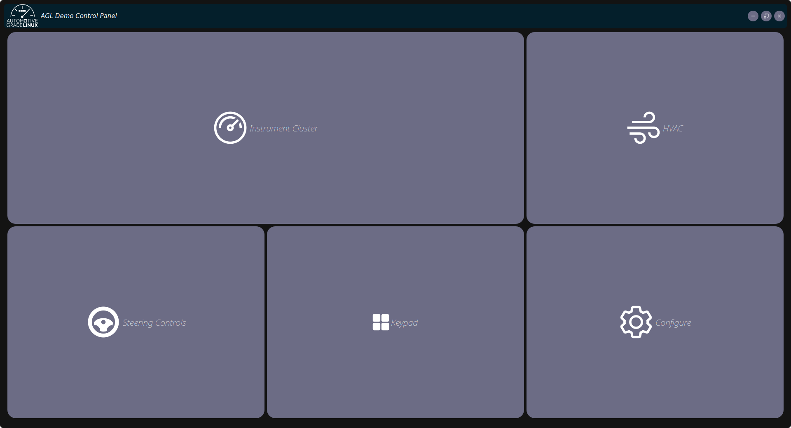
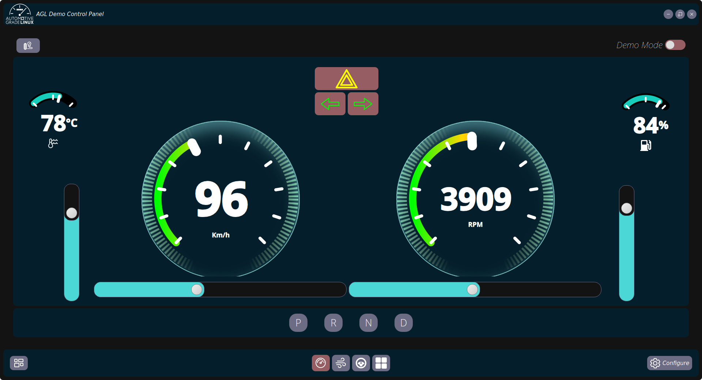
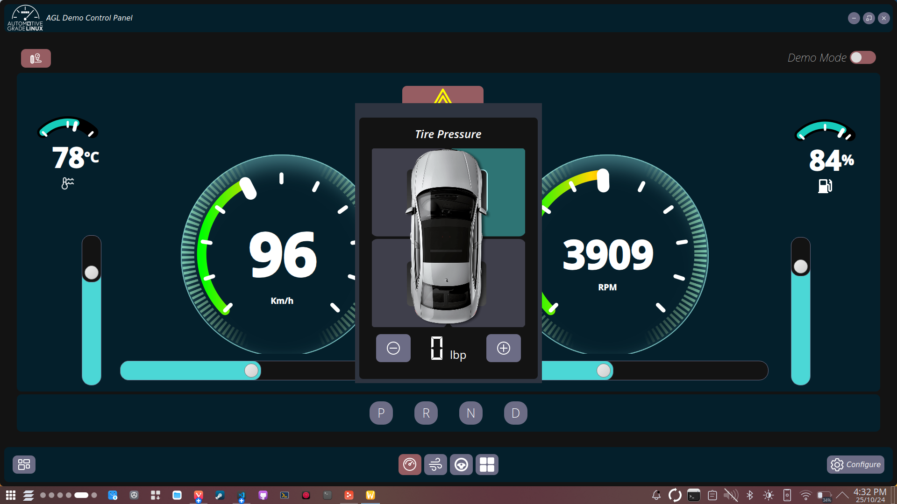
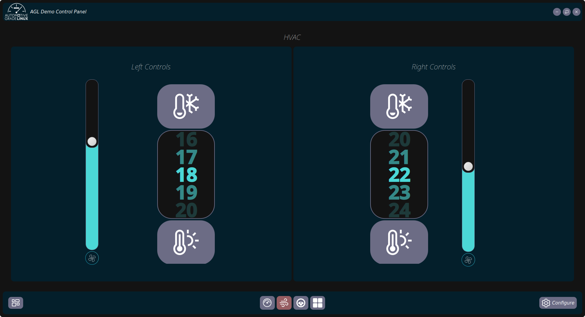
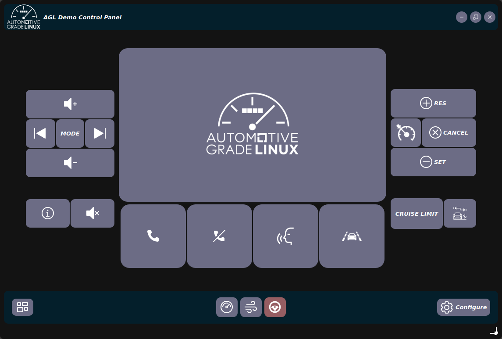
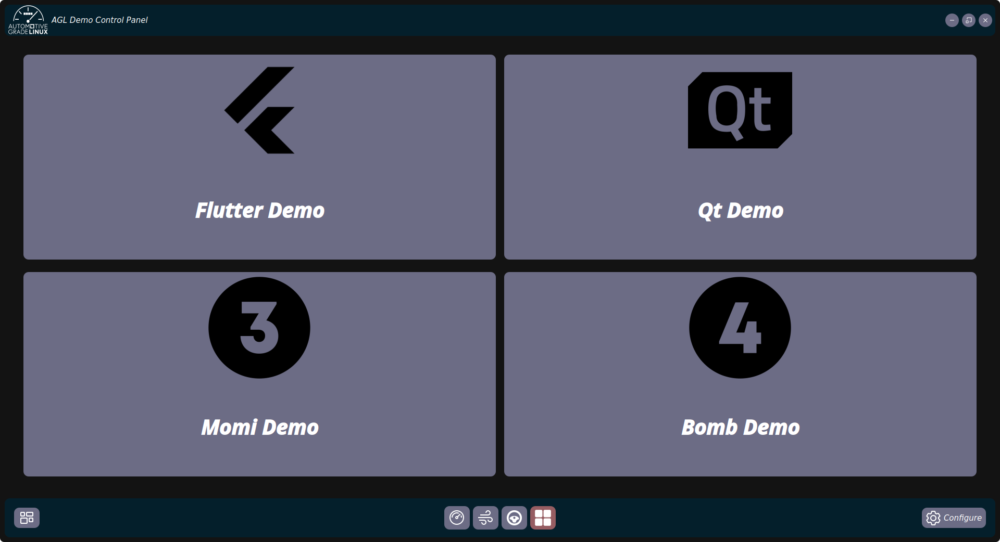
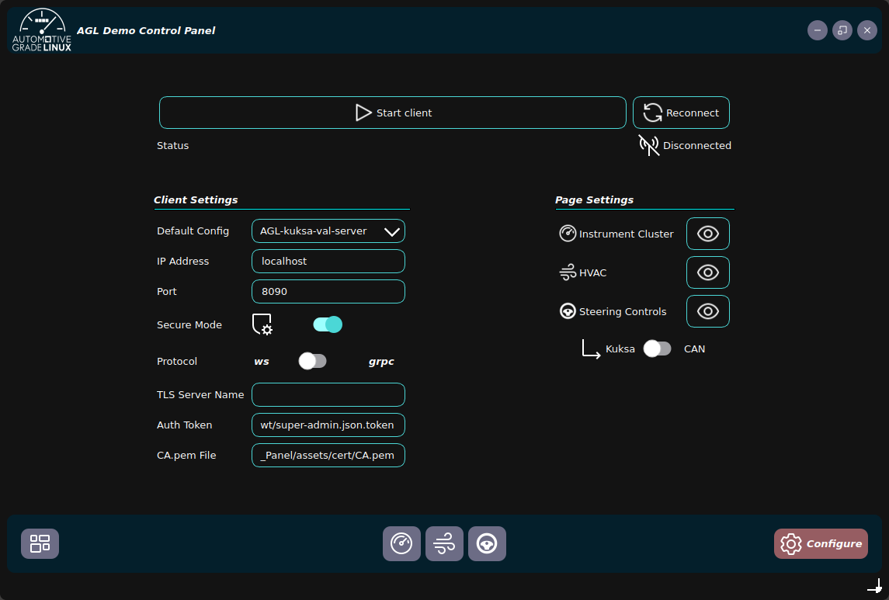
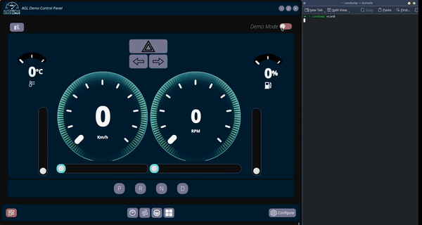

## Introduction

This report is a requirement of the Final evaluation phase of the [Google Summer of Code 2024](https://summerofcode.withgoogle.com/) the Google program. I worked with the Linux Foundation, under [Automotive Grade Linux](https://www.automotivelinux.org/) to [Extend AGL's Demo Control Panel](https://summerofcode.withgoogle.com/programs/2024/projects/WxbmtPoG), which was my contribution during **GSoC 2023** under the GSoC project _[Qt5 Application to Visualise/ Simulate CAN bus traffic using Kuksa.val](https://summerofcode.withgoogle.com/archive/2023/projects/4GykHUGj)_

You can find the proposal for this year's project [here](https://summerofcode.withgoogle.com/media/user/7727eb0be3f8/proposal/gAAAAABnHxuXdDuvhsW6_aP6iKY8t1otSUNLBJ1gvQ-SKH2FjxgMUrjpuijuLQJUKFzMdabMo-UBjjVbpSa0uaiw-uxQ-2lH0d9VVUtDB-4iuD49uol7-Ek=.pdf).

[The Linux Foundation](https://www.linuxfoundation.org/) is a nonprofit consortium dedicated to fostering the growth of Linux. [Automotive Grade Linux](https://www.automotivelinux.org/) is an open-source project hosted by The Linux Foundation that is building an open operating system and framework for automotive applications.

---
## Project Overview

The objective of this year's project was to build upon my last year's contribution to **Extend AGL's Demo Control Panel**. The application developed allows the end-users to emit signals using the kuksa-client SDK and Python-can to visualize and interact with AGL Demo applications, such as the IC, IVI, HVAC, and the Green Machine, that display CAN data through Kuksa.val.

## Demo Video

<video src="./Demo.mp4" controls="controls" style="max-width: auto; border-radius: 10px">
</video>


  
  
  
  
  
  
  
   
    


### # Source Code & Documentation

→ Code Hosted on Gerrit: [agl-demo-control-panel](https://gerrit.automotivelinux.org/gerrit/admin/repos/src/agl-demo-control-panel,general)

→ Documentation: [AGL/documentation](https://docs.automotivelinux.org/en/master/#06_Component_Documentation/09_AGL_Demo_Control_Panel/)

### # Deliverables

- Porting the app from Qt5 to Qt6 framework.
- Adding better QML widgets/ animations for gauges and spin-wheel inputs. 
- Adding file playback (e.g. for CARLA recordings)
- Visualizing signals (real-time and playback)
- Adding New Controls and Keypad Features
    - IC keypad feature
    - Power-control feature
- Integrate the application with the AGL Demo platform.
- Packaging and distribution of the Application.
- Update documentation pages based on work.

---
## Work Done
### # Progress Reports

[→ Community Bonding Period](/articles/gsoc24/community-bonding-period): During the GSoC 2024 community bonding period, I had a fantastic learning experience. I got to re-connect with my GSoC mentors and the AGL community, I re-familiarized myself with AGL tools, and set up my working environment. I also tackled some technical challenges and ventured into working with CARLA, Qt6/QML, and AGL images. Overall, the community bonding period was a great start.

[→ Coding Period](/articles/gsoc24/week-01): The coding period of GSoC is a dedicated timeframe during which the accepted contributors work on their projects. The standard coding period is **12 weeks**. However, my mentors and I saw it fit to have a longer coding period of **22 weeks** to complete our **Large-Scale project**.

During this period, I was able to:

- Write and submit my code to Gerrit/GitHub.
- Issue patches and bug fixes based on review.
- Regularly communicate with my mentors. (_Mondays_)
- Participate in the AGL and GSoC community. (_Thursdays_)
- Submit my work for mid-term and final evaluations.

Below I have compiled all my Weekly Progress Reports for the duration of the coding period of _GSoC '24_.

|  |  |  |  |
|----------|----------|----------|----------|
| [Week 1 ](/articles/gsoc24/week-01)  | [Week 2 ](/articles/gsoc24/week-02)  | [Week 3 ](/articles/gsoc24/week-03)  | [Week 4 ](/articles/gsoc24/week-04)  |
| [Week 5 ](/articles/gsoc24/week-05)  | [Week 6 ](/articles/gsoc24/week-06)  | [Week 7 ](/articles/gsoc24/week-07)  | [Week 8 ](/articles/gsoc24/week-08)  |
| [Week 9 ](/articles/gsoc24/week-09)  | [Week 10](/articles/gsoc24/week-10) | [Week 11](/articles/gsoc24/week-11) | [Week 12](/articles/gsoc24/week-12) |
| [Week 13](/articles/gsoc24/week-13) | [Week 14](/articles/gsoc24/week-14) | [Week 15](/articles/gsoc24/week-15) | [Week 16](/articles/gsoc24/week-16) |
| [Week 17](/articles/gsoc24/week-17) | [Week 18](/articles/gsoc24/week-18) | [Week 19](/articles/gsoc24/week-19) | [Week 20](/articles/gsoc24/week-20) |
| [Week 21](/articles/wgsoc24/week-21) | [Week 22](/articles/gsoc24/week-22) | | |

### # Major Gerrit Commits
- [x] [29969:](https://gerrit.automotivelinux.org/gerrit/c/src/agl-demo-control-panel/+/29969) Port AGL Demo Control Panel to Qt6
- [x] [30049](https://gerrit.automotivelinux.org/gerrit/c/src/agl-demo-control-panel/+/30049): Add Python Script to Convert CARLA data into CAN messages
- [x] [30275](https://gerrit.automotivelinux.org/gerrit/c/src/agl-demo-control-panel/+/30275): Add New Custom Gauges and CARLA playback refactored
- [x] [30327](https://gerrit.automotivelinux.org/gerrit/c/src/agl-demo-control-panel/+/30327): Update Carla Playback Mode
- [x] [30401](https://gerrit.automotivelinux.org/gerrit/c/src/agl-demo-control-panel/+/30401): Add Tire Pressure, Keypad elements and misc. UI Changes
- [x] [30454](https://gerrit.automotivelinux.org/gerrit/c/AGL/meta-agl-demo/+/30454): agl-demo-control-panel: Update dependency and Bump SRCREV
- [ ] [30456](https://gerrit.automotivelinux.org/gerrit/c/src/agl-demo-control-panel/+/30456): Bug fixes for Control Panel
- [ ] [30444](https://gerrit.automotivelinux.org/gerrit/c/AGL/documentation/+/30444): agl-demo-control-panel: Update Documentation

---

## Conclusion

### # What did I learn?

- I was able to dive deeper into the OpenEmbedded Yocto Project and create layers and recipes for our specific application.
- I learnt how to create and port applications to [Qt6](https://www.qt.io/), [PyQt](https://wiki.python.org/moin/PyQt) and [QML](https://doc.qt.io/qt-6/qmlapplications.html).
- Learnt about [gRPC](https://grpc.io/) and [WebSocket](https://www.geeksforgeeks.org/what-is-web-socket-and-how-it-is-different-from-the-http/) and how they are implemented in Kuksa.val and its Python SDK.
- I had the opportunity to test my application and AGL images on a [Raspberry Pi 4](https://www.raspberrypi.com/products/raspberry-pi-4-model-b/) kindly provided by my AGL mentors last year.
- I also had the opportunity to learn about the [CARLA Simulator](https://carla.org), a simulation platform developed from the ground up to support development, training, and validation of autonomous driving systems. Making use of its flexible APIs; I was able to provide the **File Playback** feature to the agl-demo-control-panel.
- I also learned a lot more about the Automotive Grade Linux organization, its development tools, workflow, and pipeline.
### # Post GSoC

- I plan to maintain and add to the Automotive Grade Linux’s repository for my project for the foreseeable future and work on continually improving it.
- I will keep contributing and help other new contributors to explore and learn projects in this organization.

---
## Acknowledgments

I would like to express my gratitude to my mentors [Jan-Simon Möller](https://www.automotivelinux.org/blog/developer-showcase-jansimon-moller/), [Justin Noel](https://www.linkedin.com/in/justin-noel-95aa5b5/), [Scott Murray](https://www.konsulko.com/about/meet-the-team#:~:text=extremely%20small%20systems.-,Scott%20Murray,-Principal%20Software%20Engineer), [Marius Vlad](mailto:marius.vlad@collabora.com), and [Walt Miner](https://www.automotivelinux.org/about/leadership/) and for mentoring me through another year of GSoC and also to the whole AGL community for being so inclusive and friendly.

It has been one of the best professional experiences. Learning about new tools and technologies, and working on an open-source project along with experienced developers from all over the world has been a great experience for me. I would love to continue working with AGL, improving my project, and whatever I feel that I can contribute to.