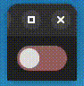

## Tasks Completed:

## # New Animations

This week I made significant changes to the UI elements and animations of the `AGL Demo Control Panel` to make it more responsive optimized.

Changes can be reviewed here in [29969: Port AGL Demo Control Panel to Qt6](https://gerrit.automotivelinux.org/gerrit/c/src/agl-demo-control-panel/+/29969) 

<video src="./Demo.mp4" controls="controls" style="max-width: auto; border-radius: 10px">
</video>

#### Toggle Button

This week I rewrote the `animatedToggle.py` module to remove dependency on the `qtwidgets` library (Not compatible with Qt6 yet).



#### Navigation Bar

The Navigation Bar Animation was also updated to have Bounce effect using "OutBounce" QEasingCurve.

### # Converting Data from CARLA to CAN messages

This Week I modified the [manual_control.py](https://github.com/carla-simulator/carla/blob/dev/PythonAPI/examples/manual_control.py) module from the `CARLA Python API examples` programs to convert the extracted data into their equivalent CAN format using the [agl-vcar.dbc](https://git.automotivelinux.org/AGL/meta-agl-demo/tree/recipes-connectivity/kuksa-val/kuksa-can-provider/agl-vcar.dbc) file. 

```python
class convert_to_can(object):
    def __init__(self):
        self.db = cantools.database.load_file('test.dbc')
        self.can_bus = can.interface.Bus('vcan0', bustype='socketcan')
        self.speed_message = self.db.get_message_by_name('Vehicle_Status_1')
        self.gear_message = self.db.get_message_by_name('Transmission')
        self.speed_cache = 0
        self.steer_cache = 0
        self.gear_cache = "P"
    def send_car_speed(self, speed):
        if int(speed) != int(self.speed_cache):
            if(int(speed) != 0):
                self.send_gear("D")
            else:
                self.send_gear("P")
            self.speed_cache = speed
            data = self.speed_message.encode({'CAR_SPEED': speed})
            message = can.Message(arbitration_id=self.speed_message.frame_id, data=data)
            self.can_bus.send(message)

    .
    .
    .
    .
```

## Next Week Tasks:

- Continue work on file playback using CARLA.
- Add support in AGL Demo Control Panel to Playback CAN Dump files.
- Continue working on New Page to display tyre pressure data.
- Bump up kuksa-client from 0.4.2 to 0.4.3 (Latest).