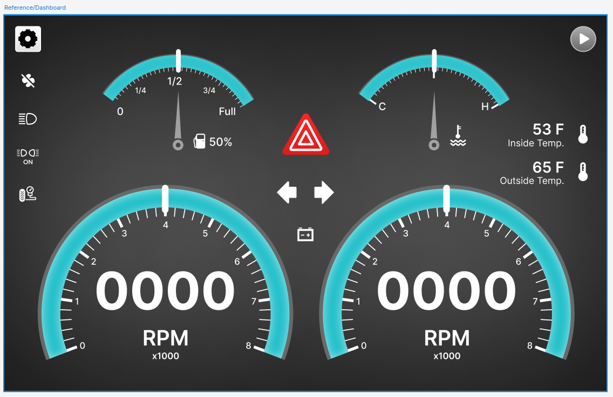

## Tasks Completed:

During the eleventh week of my Google Summer of Code (GSoC) project, I continued working on refactoring developing the UI elements and the Keypad features for the `AGL-Demo-Control-Panel`. Below, I provide detailed information about the tasks completed, documentation updates, and plans for the upcoming week.

### # (WIP) New Gauges

This week I focused on refactoring the Engine RPM and the Vehicle Speed Gauges.

These new widgets are written in QML, being more flexible and versatile will lead to the UI elements being more expressive.

Here is the reference design shared by the **ICS** team amd **Justin Noel** which I'm using as refernce for the new UI.

The `AGL Demo Control Panel` will still use PyQt6 for the main application while the new QML elements will be handled by separate modules to be rendered as child QObjects.

<video src="./WIP_Demo.mp4" controls="controls" style="max-width: auto; border-radius: 10px">
</video>

These widget has to be designed from scratch since Qt6 does not support the `CircularGauge QML Type`.

### # (WIP) Keypad features

This week I continued working on implementing the Keypad Page, where the keypad buttons make calls using "ssh root@<IP> -c 'wrapper-script-xyz.sh' " on remote host by splicing out the actual commands from momikey into separate
scripts that momikey (new) and the ssh calls invoke.

## Next Week Tasks:

- Continue working on the new UI elements and keypad page.
- Push changes to Gerrit for review by mentors.