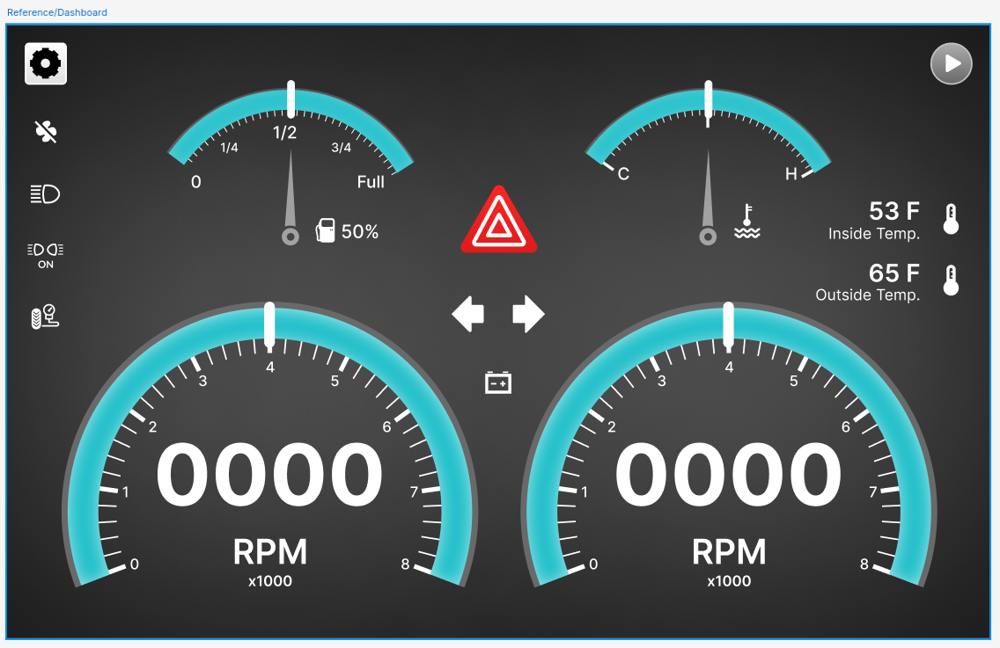

## Tasks Completed:

During the thirteenth week of my Google Summer of Code (GSoC) project, I continued working on refactoring developing the UI elements and the Keypad features for the `AGL-Demo-Control-Panel`. Below, I provide detailed information about the tasks completed, documentation updates, and plans for the upcoming week.

### # Keypad Features

This week I refactored the Keypad Page, changes include:

- SSH Session is retained, 
- User is prompted upon disconnect
- Config File support to enable or disable visibility of page

<video src="./Keypad.mkv" controls="controls" style="max-width: auto; border-radius: 10px">
</video>

This has been acomplished using the `Paramiko` library.

Using `Paramiko` over direct system calls for SSH operations offers several advantages,

- Session Reuse: Paramiko supports reusing SSH sessions, which can significantly reduce connection overhead when executing multiple commands against the same server. Managing such connections efficiently with system calls requires additional logic.
- SFTP Support: Beyond just executing commands, Paramiko also supports SFTP operations, allowing for secure file transfers over SSH. Implementing SFTP functionality via system calls would require additional tools and more complex setup.
- and more.

The keys execte the following command on the host system, for reference; [momikey.sh](https://git.automotivelinux.org/AGL/meta-agl-devel/tree/meta-agl-ic-container/recipes-demo/momikey/files/momikey.sh)


```python

class MomiKeyHandler:
    def __init__(self):
        config_data = config.get_ssh_config()        

        self.ssh_client = None

        self.host = config_data.get("host") if config_data.get("host") else None
        self.username = config_data.get("username") if config_data.get("username") else None
        self.password = config_data.get("password") if config_data.get("password") else None
        self.ssh_key_path = config_data.get("ssh_key_path") if config_data.get("ssh_key_path") else None

    def establish_ssh_connection(self):
        try:
            self.ssh_client = paramiko.SSHClient()
            self.ssh_client.set_missing_host_key_policy(paramiko.AutoAddPolicy())

            if self.password is None:
                self.password = getpass("Enter password for {}: ".format(self.username))

            if self.ssh_key_path:
                private_key = paramiko.RSAKey.from_private_key_file(self.ssh_key_path)
                self.ssh_client.connect(hostname=self.host, username=self.username, pkey=private_key)
            else:
                self.ssh_client.connect(hostname=self.host, username=self.username, password=self.password)

        except Exception as e:
            print(f"Connection failed: {e}")
            sys.exit(1)

    def execute_script(self, command):
        if not self.ssh_client or not self.ssh_client.get_transport().is_active():
            self.establish_ssh_connection()

        try:
            stdin, stdout, stderr = self.ssh_client.exec_command(command)
            output = stdout.read().decode()
            error_output = stderr.read().decode()
            if output:
                print(output)
            if error_output:
                print(error_output)
        except Exception as e:
            print(f"Execution failed: {e}")

class KeypadWidget(Base, Form):
    def __init__(self, parent=None):
        super(self.__class__, self).__init__(parent)
        self.setupUi(self)
        self.momi_key_handler = None

        # Mapping of keys to commands
        self.key_commands = {
            "Key_1": "echo 'Key 1 pressed' # cmcontrol --change-active-guest-name=agl-flutter-ivi-demo && cmcontrol --shutdown-guest-role=ivi",
            "Key_2": "echo 'Key 2 pressed' # cmcontrol --change-active-guest-name=agl-qt-ivi-demo && cmcontrol --shutdown-guest-role=ivi",
            "Key_3": "echo 'Key 3 pressed' # cmcontrol --change-active-guest-name=agl-momi-ivi-demo && cmcontrol --shutdown-guest-role=ivi",
            "Key_4": "echo 'Key 4 pressed' # cmcontrol --change-active-guest-name=agl-html5-ivi-demo && cmcontrol --shutdown-guest-role=ivi",
            "Key_5": "echo 'Key 5 pressed' # cmcontrol --force-reboot-guest-role=ivi",
        }
        
        # Connect all keys to the same slot
        for key_name in self.key_commands.keys():
            key_button = self.findChild(QPushButton, key_name)
            key_button.clicked.connect(lambda _, x=key_name: self.execute_script(x))

    def execute_script(self, key_name):
        if self.momi_key_handler is None:
            self.momi_key_handler = MomiKeyHandler()
        command = self.key_commands[key_name]
        self.momi_key_handler.execute_script(command)

if __name__ == '__main__':
    app = QApplication(sys.argv)
    w = KeypadWidget()
    w.show()
    sys.exit(app.exec())
```


### # (WIP) New QML UI

This week I continued working on the QML-based UI elements for the `AGL-Demo-Control-Panel`.

These new widgets are written in QML, being more flexible and versatile will lead to the UI elements being more expressive.

Here is the reference design shared by the **ICS** team amd **Justin Noel** which I'm using as refernce for the new UI.



The `AGL Demo Control Panel` will still use PyQt6 for the main application while the new QML elements will be handled by separate modules to be rendered as child QObjects.

This week I also collaborated with **Justin Noel / ICS** to refer to their generated code for the `Control Panel` demo app written in C++ and [GreenHouse](https://www.ics.com/greenhouse) code generator.

While the code is generated and not a drop in solution to the `AGL-Demo-Control-Panel`, it gives me a good base for reference. 


## Next Week Tasks:

- Continue working on the new UI elements.
- Build and test images for the new UI and features.
- Push changes to Gerrit for review by mentors.