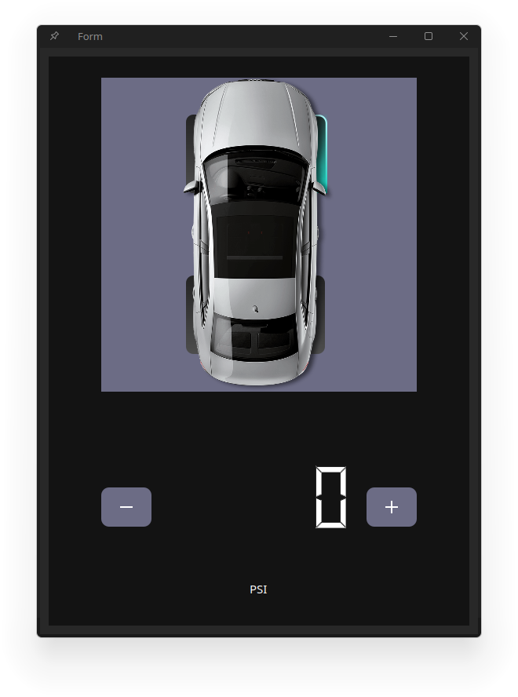

## Tasks Completed:

During the nineteenth week of my Google Summer of Code (GSoC) project, I continued working on refactoring developing the UI elements and the CARLA playback features for the `AGL-Demo-Control-Panel`. Below, I provide detailed information about the tasks completed, documentation updates, and plans for the upcoming week.

### # Tire Pressure Widget and Keypad inputs

This week I integrated the Tire Pressure and Keypad widgets into the control panel.

<video src="./Vid.webm" controls="controls" style="max-width: auto; border-radius: 10px">
</video>

### # Bug fixes:
- (WIP): Garbage values displayed on Half-Gauge widgets when Demo playback is enabled.
- CARLA playback implementation fixed threaded playback.
- Updated IC page sliders height/ width to improve touch input.
- Display correct icons for Gauges (Fuel and Coolant)

### # Code pushed for review: 
- [30327](https://gerrit.automotivelinux.org/gerrit/c/src/agl-demo-control-panel/+/30327): (WIP) Update Carla Playback Mode.

### # Code Merged this week:
- [30275](https://gerrit.automotivelinux.org/gerrit/c/src/agl-demo-control-panel/+/30275): Add New Custom Gauges and CARLA playback refactored
- [30324](https://gerrit.automotivelinux.org/gerrit/c/src/agl-demo-control-panel/+/30324): AGL Demo Control Panel: Enable Networking and QtQuick

## What I plan to do next:
- Finalize all changes and push code to Gerrit.
- Update documentation as required.